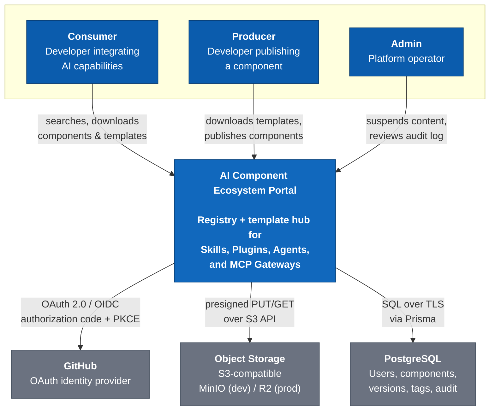
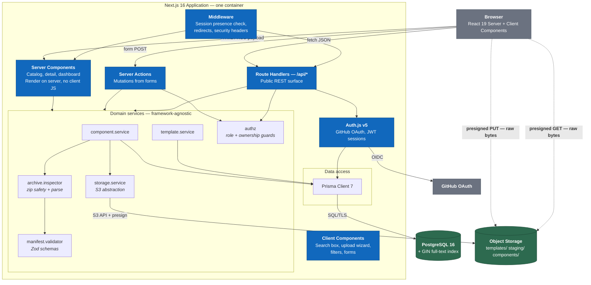
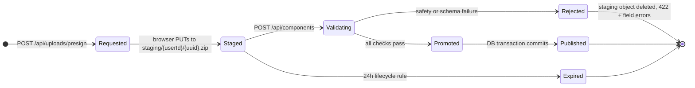

# 01 — Architecture

## 1. Architectural style

**A modular monolith deployed as a single container.**

One Next.js application contains the marketing pages, the catalog UI, the authenticated
dashboard, and the entire HTTP API. Internally it is split into hard-edged modules with
one-way dependencies. Externally it is one deployable, one log stream, one migration
target.

Why not microservices: with one developer and 17 days, the coordination cost of multiple
services buys nothing. The _right_ senior signal here is not "I split it into services" —
it is "I drew clean internal boundaries so it _could_ be split, and I can tell you exactly
where the seams are." Those seams are §4 below.

## 2. C4 Level 1 — System context



**The key context fact:** the browser talks to object storage **directly** for both upload
and download, using presigned URLs the portal mints. Bytes never stream through the
application server. This is not a micro-optimization — see §5.

## 3. C4 Level 2 — Containers



## 4. Module boundaries and the dependency rule

```
src/
├── app/                     ← Next.js routing. THIN. Parses input, calls a service,
│   │                          shapes the response. No business logic, no Prisma.
│   ├── (marketing)/         ← public: /, /about
│   ├── (catalog)/           ← public: /catalog, /components/[slug], /templates
│   ├── (dashboard)/         ← authed: /dashboard, /publish, /settings
│   ├── (admin)/             ← ADMIN only
│   └── api/                 ← Route Handlers
├── server/
│   ├── services/            ← BUSINESS LOGIC LIVES HERE. Plain TS. No `next/*` imports.
│   ├── repositories/        ← the only place Prisma Client is touched
│   ├── auth/                ← Auth.js config + authz guards
│   └── storage/             ← S3 client + presigner
├── domain/                  ← Zod schemas, types, error taxonomy. Zero dependencies.
├── components/ui/           ← shadcn primitives (generated)
├── components/features/     ← composed feature UI
└── lib/                     ← logger, env parser, small utilities
```

**The dependency rule — enforced by ESLint `import/no-restricted-paths`:**

```
app/ ──▶ server/ ──▶ repositories/ ──▶ Prisma
 │         │
 └─────────┴──▶ domain/          (domain imports nothing)
```

Arrows only point right. Concretely:

- `domain/` MUST NOT import from anywhere else. It is pure schemas and types.
- `server/services/` MUST NOT import `next/*`. This is what makes them unit-testable in
  Vitest without a Next.js runtime — and what would let you lift them into a separate
  service later.
- `app/` MUST NOT import `@prisma/client` directly. Always through a repository.
- Nothing outside `server/` may import a repository.

> This rule is written into [`.claude/rules/20-architecture-boundaries.md`](../.claude/rules/20-architecture-boundaries.md)
> so the coding agent enforces it too, and into `eslint.config.ts` so CI does.

## 5. Three decisions that shape everything

### 5.1 Uploads and downloads bypass the application server

Files move **browser ↔ object storage** directly. The server only mints presigned URLs
and records metadata.

| Driver                  | Detail                                                                                                                                                             |
| ----------------------- | ------------------------------------------------------------------------------------------------------------------------------------------------------------------ |
| **Hard platform limit** | Vercel caps serverless request bodies at **4.5 MB**. Proxying a 10 MB component archive through a Route Handler simply fails in production. This alone decides it. |
| **Memory**              | Buffering multi-MB uploads in a 1 GB serverless function is how you get OOM under concurrency.                                                                     |
| **Cost & latency**      | Egress from R2 is free and geographically closer to the user than your app region.                                                                                 |
| **Separation**          | The app becomes a control plane. Storage is the data plane. That is the correct shape.                                                                             |

The trade-off is that validation cannot happen during transfer. It happens in a **second
server-initiated pass** over the staged object — which is why staging and promotion exist
(§5.2).

### 5.2 Two-phase publish: stage → validate → promote



An object in `staging/` is **never** catalog-visible and is never served to another user.
A bucket lifecycle rule deletes `staging/*` after 24 hours, so abandoned uploads cannot
accumulate. Promotion is a server-side copy (`CopyObject`) followed by a delete — no bytes
re-traverse the network.

The DB write and the storage promotion are **not** a distributed transaction. Ordering:
promote the object first, then commit the DB transaction. A crash between them leaves an
orphaned object (wasted bytes, harmless) rather than a catalog row pointing at nothing
(a 404 on download — user-visible). _Always fail toward the harmless side._ A weekly
reconciliation job can sweep orphans; it is not required for v1.

### 5.3 Storage is programmed against the S3 API, never against a vendor

All storage goes through `server/storage/storage.service.ts`, which wraps
`@aws-sdk/client-s3`. MinIO (local Docker), Cloudflare R2 (production), AWS S3, and
Azure Blob (via its S3-compatible endpoint) are then all reachable by changing four
environment variables:

```
S3_ENDPOINT   S3_REGION   S3_ACCESS_KEY_ID   S3_SECRET_ACCESS_KEY
```

The word "R2" appears in exactly one file: `.env`. This is what "cloud-portable" means
in practice, and it is a strong interview answer.

## 6. Rendering strategy

Next.js gives four rendering modes. Using the right one per page is a visible competence
signal — defaulting everything to `"use client"` is a visible _anti_-signal.

| Route                              | Mode                               | Why                                          |
| ---------------------------------- | ---------------------------------- | -------------------------------------------- |
| `/`                                | Static (SSG)                       | Never changes between deploys                |
| `/templates`                       | Static + revalidate 1h             | Four rows that change rarely                 |
| `/catalog`                         | Dynamic RSC, `searchParams`-driven | Query results depend on the URL; SEO matters |
| `/components/[slug]`               | Dynamic RSC + `generateMetadata`   | SEO-critical; needs per-component OG tags    |
| `/dashboard`, `/publish`           | Dynamic RSC, `force-dynamic`       | Per-user, never cacheable                    |
| Search box, filters, upload wizard | Client Components                  | Genuine interactivity only                   |

**Rule:** a component becomes a Client Component only when it needs state, an effect, a
browser API, or an event handler. Push `"use client"` as far down the tree as possible —
a client parent forces every child into the client bundle.

## 7. Technology choices, with the version pinned

Verified against the npm registry on **2026-08-09**.

| Concern        | Choice                                        | Version            | One-line justification                                                                                                                         |
| -------------- | --------------------------------------------- | ------------------ | ---------------------------------------------------------------------------------------------------------------------------------------------- |
| Framework      | Next.js (App Router)                          | `16.3.0`           | One codebase for UI + API; the spec recommends it; the largest hiring signal in the JS market                                                  |
| UI runtime     | React                                         | `19.2.8`           | Bundled with Next 16; Server Components are the default                                                                                        |
| Language       | TypeScript                                    | `~7.0.2`           | Type safety end-to-end. ⚠️ see risk note below                                                                                                 |
| Styling        | Tailwind CSS                                  | `4.3.3`            | Zero-config with Next 16; no CSS architecture decisions needed                                                                                 |
| Components     | shadcn/ui                                     | latest CLI         | Copy-in, not a dependency. You own and can read every line. Accessible via Radix.                                                              |
| ORM            | Prisma                                        | `7.9.1`            | Typed queries, first-class migrations, readable schema. Best DX for a Prisma-first learner.                                                    |
| Database       | PostgreSQL                                    | `16`               | Relational per the spec; native full-text search removes the need for Elasticsearch                                                            |
| Auth           | Auth.js (next-auth)                           | `5.0.0-beta.32`    | OAuth done correctly; Prisma adapter; no vendor lock. ⚠️ see risk note                                                                         |
| Auth adapter   | `@auth/prisma-adapter`                        | `2.11.3`           | Persists accounts/users                                                                                                                        |
| Validation     | Zod                                           | `4.4.3`            | One schema serves runtime validation, TS types, **and** the published JSON Schema                                                              |
| Storage SDK    | `@aws-sdk/client-s3` + `s3-request-presigner` | `3.1106.0`         | Vendor-neutral S3 API                                                                                                                          |
| Zip inspection | `yauzl`                                       | `3.4.0`            | **Streaming** reader — lets you enforce limits _before_ decompressing. `adm-zip` buffers everything and is the wrong tool for untrusted input. |
| Markdown       | `react-markdown` + `rehype-sanitize`          | `10.1.0` / `6.0.0` | Renders user README safely. Never `dangerouslySetInnerHTML`.                                                                                   |
| Logging        | `pino`                                        | `10.3.1`           | Structured JSON logs with request correlation                                                                                                  |
| Unit tests     | Vitest                                        | `4.1.10`           | Fast, native ESM/TS                                                                                                                            |
| E2E tests      | Playwright                                    | `1.62.1`           | Two smoke journeys only                                                                                                                        |
| Lint / format  | ESLint / Prettier                             | `10.8.1` / `3.9.6` | Enforce the boundary rules in §4                                                                                                               |
| Icons          | `lucide-react`                                | `1.30.0`           | shadcn's default                                                                                                                               |

> **⚠️ Version risk — TypeScript 7.** `typescript@latest` is now the native (Go) compiler.
> It is dramatically faster but the ecosystem is still catching up. **Mitigation:** pin
> `~7.0.2`; if `eslint`, `prisma generate`, or `next build` misbehave in Phase 0, drop to
> the latest `6.x` and record it in an ADR. Discover this on **day 1**, not day 14.
> Phase 0 has an explicit gate for it.

> **⚠️ Version risk — Auth.js v5 is still tagged `beta`.** It has been the de-facto
> standard for App Router auth for over two years and is widely run in production, but
> the tag is real. **Mitigation:** pin the _exact_ version `5.0.0-beta.32` (no caret).
> Fallback is `next-auth@4.24.15`, which costs roughly half a day to swap. Recorded in
> [ADR-004](adr/ADR-004-authentication.md).

### Deliberately rejected

| Rejected                                      | Reason                                                                                                                                                                                                                                                                                                |
| --------------------------------------------- | ----------------------------------------------------------------------------------------------------------------------------------------------------------------------------------------------------------------------------------------------------------------------------------------------------- |
| MERN (Express + MongoDB + separate React SPA) | The spec asks for relational + type-safe full-stack. Two deployables, two CORS configs, hand-rolled auth, and no schema enforcement — more work for a weaker result. This is the stack you know; it is the wrong tool here, and _saying so with reasons_ is worth more in an interview than using it. |
| Elasticsearch / Algolia                       | Postgres `tsvector` + GIN handles thousands of rows in single-digit milliseconds. Another container for zero benefit at this scale.                                                                                                                                                                   |
| Redis                                         | Only needed for rate limiting; a Postgres counter table is sufficient at this scale. Adding Redis is easy later.                                                                                                                                                                                      |
| tRPC                                          | Excellent DX, but a bespoke RPC protocol closes the door on the public REST API and future CLI. REST + OpenAPI is the enterprise-legible choice.                                                                                                                                                      |
| Kubernetes                                    | Operationally serious, demo-value zero, and it will not run free. `docker compose` + a managed platform is the honest answer.                                                                                                                                                                         |
| Clerk / Auth0                                 | Fast, but you learn nothing about OAuth and gain a paid dependency.                                                                                                                                                                                                                                   |

## 8. Non-functional targets

| Attribute              | Target                                            | How it is achieved                                                          |
| ---------------------- | ------------------------------------------------- | --------------------------------------------------------------------------- |
| Catalog search latency | p95 < 300 ms (10k components)                     | GIN index on `tsvector`; keyset-friendly pagination; RSC streaming          |
| Publish validation     | < 3 s for a 10 MB archive                         | Streaming `yauzl` inspection; no full decompression to disk                 |
| Availability           | Best-effort (free tier)                           | Stateless app; state lives in managed Postgres + object storage             |
| Max archive size       | 10 MB compressed / 50 MB uncompressed             | Enforced twice: presign `content-length-range` **and** server-side re-check |
| Cold start             | < 2 s                                             | Next standalone output; Prisma client reuse across invocations              |
| Accessibility          | WCAG 2.1 AA                                       | Radix primitives; keyboard-navigable; `eslint-plugin-jsx-a11y` in CI        |
| Security               | No public bucket; no secrets in the client bundle | Presigned URLs only; `env.ts` splits server/client vars at build time       |

## 9. Where the seams are, if this ever needed splitting

Asked "how would you scale this?", the honest answer names specific seams rather than
saying "microservices":

1. **`archive.inspector` → a queue worker.** Validation is the only CPU-bound path. Move
   it behind a job queue; publish becomes async with a `PENDING` status. This is the
   first thing that would break under load and the first thing to extract.
2. **Catalog reads → a read replica + CDN.** Reads dwarf writes. Postgres read replica
   plus `stale-while-revalidate` on catalog routes.
3. **Search → a dedicated engine.** Only past ~10⁵ components does `tsvector` stop being
   the right answer.
4. **Auth → a standalone IdP.** If organizations and SSO arrive, Auth.js gives way to
   Keycloak or Entra ID. The `authz` module already isolates every call site.

Nothing above is built now. Knowing the order is the point.
