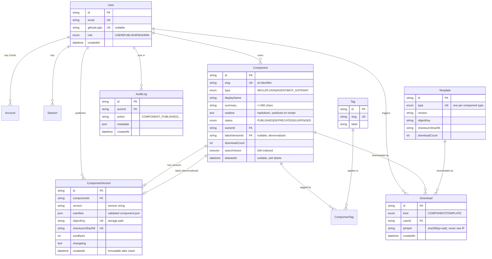

# 02 — Data Model

PostgreSQL 16 via Prisma 7. This document is the source of truth for `prisma/schema.prisma`.

## 1. Entity relationship diagram



## 2. Design decisions

### 2.1 Why `Component` and `ComponentVersion` are separate tables

The problem statement requires the data layer to "track versioning". The naive
alternative — one row per component with a mutable `fileKey` — makes republishing
**destructive**: anyone who depended on `1.0.0` silently receives different bytes.

Splitting them buys three properties:

- **Immutability.** A `ComponentVersion` row is insert-only. Nothing updates it after
  creation. `(componentId, version)` is unique forever.
- **Integrity.** Each version carries its own SHA-256. A consumer can verify the archive
  they downloaded is byte-identical to what was published.
- **Truthful history.** The detail page can show a real version timeline.

`Component.latestVersionId` is a deliberate denormalization: the catalog lists hundreds of
components and needs the current version of each without an aggregate subquery per row.
It is written inside the same transaction as the version insert, so it cannot drift.

### 2.2 Manifest stored as `Json`, not shredded into columns

The validated `component.json` is stored whole in `ComponentVersion.manifest` (`jsonb`).

- The manifest is a **discriminated union** — an MCP Gateway's fields have almost no
  overlap with an Agent's. Shredding it means either 40 mostly-null columns or four
  subtype tables. Both are worse.
- It is already validated by Zod at the gate, so the JSON is guaranteed well-formed by
  the time it lands.
- `jsonb` is queryable and indexable if a specific field later needs filtering.
- Fields that drive _listing and filtering_ (`type`, `displayName`, `summary`, tags) are
  promoted to real columns. Everything else stays in the blob. **Promote what you query,
  blob what you display.**

### 2.3 Soft delete on `Component` only

`Component.deletedAt` is nullable. Deleting hides the component from the catalog but
retains download history and audit records for integrity. `ComponentVersion` rows are
never deleted — a hard delete would break the checksum-history guarantee. A Prisma
extension applies `deletedAt: null` by default so a forgotten `where` clause cannot leak
deleted rows.

### 2.4 IP addresses are hashed, never stored raw

`Download.ipHash = sha256(ip + DOWNLOAD_IP_SALT)`. This supports abuse detection and
de-duplicated download counting without holding personal data — a GDPR data-minimisation
posture, and a genuinely good thing to be able to explain.

## 3. Prisma schema

Target file: `prisma/schema.prisma`. Written here in full so implementation is
transcription, not invention.

> **⚠️ Prisma 7 changed how connections are configured.** `url` is no longer allowed in
> the `datasource` block — the CLI reads it from `prisma.config.ts`, and the runtime
> client is constructed with an explicit **driver adapter** (`@prisma/adapter-pg`).
> Tutorials and answers written for Prisma ≤6 will show the old form and will not
> validate. See `prisma.config.ts` and `src/server/db.ts` in the repo, and
> [ADR-011](adr/ADR-011-toolchain-outcome.md).

```prisma
generator client {
  provider = "prisma-client-js"
}

// No `url` here in Prisma 7. Migrations read prisma.config.ts; the app passes a
// driver adapter to the PrismaClient constructor.
datasource db {
  provider = "postgresql"
}

// ─────────────────────────── enums ───────────────────────────

enum Role {
  USER       // can browse and download
  PUBLISHER  // can publish components  (granted on first successful publish)
  ADMIN      // can suspend content, read audit log
}

enum ComponentType {
  SKILL
  PLUGIN
  AGENT
  MCP_GATEWAY
}

enum ComponentStatus {
  PUBLISHED
  DEPRECATED // visible, flagged, still downloadable
  SUSPENDED  // hidden by an admin; not downloadable
}

enum DownloadKind {
  COMPONENT
  TEMPLATE
}

// ─────────────────── Auth.js required models ───────────────────
// Shape is dictated by @auth/prisma-adapter. Do not rename fields.

model User {
  id            String    @id @default(cuid())
  name          String?
  email         String?   @unique
  emailVerified DateTime?
  image         String?

  githubLogin String? @unique
  role        Role    @default(USER)

  accounts   Account[]
  sessions   Session[]
  components Component[]
  versions   ComponentVersion[] @relation("PublishedBy")
  downloads  Download[]
  auditLogs  AuditLog[]

  createdAt DateTime @default(now())
  updatedAt DateTime @updatedAt

  @@index([role])
}

model Account {
  id                String  @id @default(cuid())
  userId            String
  type              String
  provider          String
  providerAccountId String
  refresh_token     String? @db.Text
  access_token      String? @db.Text
  expires_at        Int?
  token_type        String?
  scope             String?
  id_token          String? @db.Text
  session_state     String?

  user User @relation(fields: [userId], references: [id], onDelete: Cascade)

  @@unique([provider, providerAccountId])
  @@index([userId])
}

model Session {
  id           String   @id @default(cuid())
  sessionToken String   @unique
  userId       String
  expires      DateTime
  user         User     @relation(fields: [userId], references: [id], onDelete: Cascade)

  @@index([userId])
}

model VerificationToken {
  identifier String
  token      String   @unique
  expires    DateTime

  @@unique([identifier, token])
}

// ─────────────────────── domain models ───────────────────────

model Component {
  id          String          @id @default(cuid())
  slug        String          @unique          // "pdf-extractor"
  name        String                            // manifest `name`
  displayName String
  type        ComponentType
  summary     String          @db.VarChar(300)
  readme      String?         @db.Text          // markdown from README.md in the archive
  status      ComponentStatus @default(PUBLISHED)
  license     String          @default("MIT")
  homepage    String?
  repository  String?

  ownerId String
  owner   User   @relation(fields: [ownerId], references: [id], onDelete: Cascade)

  // Denormalized pointer, written in the same tx as the version insert.
  latestVersionId String?           @unique
  latestVersion   ComponentVersion? @relation("LatestVersion", fields: [latestVersionId], references: [id])

  downloadCount Int @default(0)

  // Maintained by a Postgres trigger; see migration 002.
  searchVector Unsupported("tsvector")?

  versions  ComponentVersion[] @relation("ComponentVersions")
  tags      ComponentTag[]
  downloads Download[]

  createdAt DateTime  @default(now())
  updatedAt DateTime  @updatedAt
  deletedAt DateTime?

  @@index([type, status, deletedAt])
  @@index([ownerId])
  @@index([downloadCount(sort: Desc)])
  @@index([createdAt(sort: Desc)])
}

model ComponentVersion {
  id      String @id @default(cuid())
  version String                       // "1.0.0" — semver, validated by Zod

  componentId String
  component   Component @relation("ComponentVersions", fields: [componentId], references: [id], onDelete: Cascade)

  manifest       Json                  // the validated component.json
  objectKey      String  @unique       // components/{slug}/{version}/{slug}-{version}.zip
  sizeBytes      Int
  checksumSha256 String  @unique       // integrity + duplicate-upload detection
  changelog      String? @db.Text

  publishedById String
  publishedBy   User   @relation("PublishedBy", fields: [publishedById], references: [id])

  createdAt DateTime @default(now())   // NO updatedAt — rows are immutable

  latestFor Component? @relation("LatestVersion")
  downloads Download[]

  @@unique([componentId, version])
  @@index([componentId, createdAt(sort: Desc)])
}

model Tag {
  id    String @id @default(cuid())
  slug  String @unique               // "pdf"
  label String                       // "PDF"

  components ComponentTag[]
  createdAt  DateTime @default(now())
}

model ComponentTag {
  componentId String
  tagId       String

  component Component @relation(fields: [componentId], references: [id], onDelete: Cascade)
  tag       Tag       @relation(fields: [tagId], references: [id], onDelete: Cascade)

  @@id([componentId, tagId])
  @@index([tagId])
}

model Template {
  id          String        @id @default(cuid())
  type        ComponentType @unique      // exactly one template per type
  name        String
  description String        @db.Text
  version     String                     // template version, e.g. "1.0.0"

  objectKey      String
  sizeBytes      Int
  checksumSha256 String
  docsUrl        String?

  downloadCount Int @default(0)

  downloads Download[]
  createdAt DateTime   @default(now())
  updatedAt DateTime   @updatedAt
}

model Download {
  id   String       @id @default(cuid())
  kind DownloadKind

  componentId String?
  component   Component? @relation(fields: [componentId], references: [id], onDelete: SetNull)
  versionId   String?
  version     ComponentVersion? @relation(fields: [versionId], references: [id], onDelete: SetNull)
  templateId  String?
  template    Template?  @relation(fields: [templateId], references: [id], onDelete: SetNull)

  userId String?
  user   User?   @relation(fields: [userId], references: [id], onDelete: SetNull)

  ipHash    String?  @db.VarChar(64)     // sha256(ip + salt) — never the raw IP
  userAgent String?  @db.VarChar(512)
  createdAt DateTime @default(now())

  @@index([componentId, createdAt(sort: Desc)])
  @@index([templateId, createdAt(sort: Desc)])
  @@index([userId, createdAt(sort: Desc)])
}

model AuditLog {
  id      String @id @default(cuid())
  actorId String?
  actor   User?  @relation(fields: [actorId], references: [id], onDelete: SetNull)

  action     String   @db.VarChar(64)   // see the action vocabulary below
  targetType String   @db.VarChar(32)   // "Component" | "User" | "Template"
  targetId   String?
  metadata   Json?
  ipHash     String?  @db.VarChar(64)
  createdAt  DateTime @default(now())

  @@index([actorId, createdAt(sort: Desc)])
  @@index([targetType, targetId])
  @@index([action, createdAt(sort: Desc)])
}

// Fixed-window rate-limit counter — one row per (key, window).
model RateLimit {
  key         String   @db.VarChar(128) // "presign:usr_abc" — scope + subject
  windowStart DateTime
  count       Int      @default(0)
  updatedAt   DateTime @updatedAt

  @@id([key, windowStart])
  @@index([windowStart]) // for the expired-window sweep
}
```

### 3.1 `RateLimit` — the honest limitation

Limits and windows are in [`docs/03 §4`](03-api-contract.md#4-rate-limits). Two properties
of this implementation are worth stating plainly rather than glossing over:

- **The counter is atomic.** `upsert` with `{ count: { increment: 1 } }` is a single
  statement, so Postgres evaluates `count + 1` under the row lock. A `findUnique` followed
  by an `update` would let two concurrent requests both read 9 and both write 10 — and the
  eleventh request through would be allowed. There is an integration test that fires 20
  concurrent increments and asserts the count is exactly 20.
- **The window is fixed, not sliding.** A caller can spend a full allowance in the last
  second of one window and again in the first second of the next, briefly achieving double
  the nominal rate. That is acceptable for abuse damping — the guarantee that matters, no
  unbounded flood, still holds — and it avoids a Redis dependency. Upstash with a sliding
  window or token bucket is the upgrade if it ever needs to be exact.

Rows accumulate one per subject per window, so `pruneWindowsBefore()` exists for a
scheduled sweep. Nothing calls it on the request path.

## 4. Full-text search

Prisma cannot express a generated `tsvector` column, so it is added in a hand-written
migration. Create it as `prisma/migrations/‹timestamp›_search_vector/migration.sql`:

```sql
-- Weighted search vector: name/displayName rank highest, then summary, then readme.
ALTER TABLE "Component"
  ADD COLUMN IF NOT EXISTS "searchVector" tsvector
  GENERATED ALWAYS AS (
      setweight(to_tsvector('english', coalesce("displayName", '')), 'A')
   || setweight(to_tsvector('english', coalesce("name",        '')), 'A')
   || setweight(to_tsvector('english', coalesce("summary",     '')), 'B')
   || setweight(to_tsvector('english', left(coalesce("readme", ''), 20000)), 'C')
  ) STORED;

CREATE INDEX IF NOT EXISTS "Component_searchVector_idx"
  ON "Component" USING GIN ("searchVector");

-- Trigram index for typo-tolerant slug/name lookup ("pdf-extracter" → "pdf-extractor").
CREATE EXTENSION IF NOT EXISTS pg_trgm;
CREATE INDEX IF NOT EXISTS "Component_displayName_trgm_idx"
  ON "Component" USING GIN ("displayName" gin_trgm_ops);
```

A `GENERATED ALWAYS ... STORED` column is preferable to a trigger: Postgres maintains it
automatically, it cannot drift, and there is no trigger function to keep in sync.

### 4.1 Both indexes MUST also be declared in `schema.prisma`

This bit is not optional, and it is not obvious:

```prisma
searchVector Unsupported("tsvector")? @default(dbgenerated())

@@index([searchVector], type: Gin)
@@index([displayName(ops: raw("gin_trgm_ops"))], type: Gin, map: "Component_displayName_trgm_idx")
```

`prisma migrate dev` diffs `schema.prisma` against the database. Anything the schema does
not mention is, as far as Prisma is concerned, something that should not exist — so
without these three lines **every future migration silently emits**:

```sql
DROP INDEX "Component_displayName_trgm_idx";
DROP INDEX "Component_searchVector_idx";
ALTER TABLE "Component" ALTER COLUMN "searchVector" DROP DEFAULT;  -- fails
```

This actually happened while adding the unrelated `RateLimit` table on 2026-08-12. The
`ALTER` fails outright against a generated column (`use DROP EXPRESSION instead`), taking
the whole migration down with it — but the two `DROP INDEX` statements had already
committed. Search kept working, via a sequential scan, with nothing logged. That is the
worst shape a performance bug can take.

`@default(dbgenerated())` does not create a default. It tells Prisma the database supplies
the value, which is what suppresses the `DROP DEFAULT`.

**After any migration, confirm the diff is empty:**

```bash
npx prisma migrate dev --name check --create-only   # must produce "This is an empty migration."
```

### 4.2 The drift check changed in Prisma 7

CI runs the same check non-interactively. **Two flags moved**, and the old form fails in a
way that reads exactly like real drift:

```bash
# Prisma ≤6 — now exits 1 with a usage dump, which looks like "drift found"
npx prisma migrate diff --from-migrations prisma/migrations   --to-schema-datamodel prisma/schema.prisma   --shadow-database-url "$DATABASE_URL" --exit-code

# Prisma 7
npx prisma migrate diff --from-migrations prisma/migrations   --to-schema prisma/schema.prisma --exit-code
```

`--shadow-database-url` was **removed**; the shadow database now comes from
`datasource.shadowDatabaseUrl` in `prisma.config.ts`, read from `SHADOW_DATABASE_URL`.

That database is **reset on every run**, so it must be its own — pointing it at the test
database would wipe the test data mid-suite.

Exit codes with `--exit-code`: **0** empty, **1** error, **2** diff found. A 1 is a broken
command, not a schema problem.

Query it from the repository layer with a typed raw query:

```ts
// server/repositories/component.repository.ts
const rows = await prisma.$queryRaw<CatalogRow[]>`
  SELECT c.id, c.slug, c."displayName", c.summary, c.type, c."downloadCount",
         ts_rank(c."searchVector", websearch_to_tsquery('english', ${q})) AS rank
  FROM "Component" c
  WHERE c."deletedAt" IS NULL
    AND c.status = 'PUBLISHED'
    AND (${q}::text IS NULL OR c."searchVector" @@ websearch_to_tsquery('english', ${q}))
  ORDER BY rank DESC NULLS LAST, c."downloadCount" DESC
  LIMIT ${take} OFFSET ${skip};
`;
```

`websearch_to_tsquery` (not `to_tsquery`) is the right function for user input: it accepts
natural syntax like `pdf OR docx -legacy` and never throws on malformed input.
`to_tsquery` raises a syntax error on a bare quote, which becomes a 500 from a search box.

## 5. Audit action vocabulary

Keep this list closed; add to it deliberately.

| Action                        | Target    | Metadata                             |
| ----------------------------- | --------- | ------------------------------------ |
| `USER_SIGNED_IN`              | User      | `{ provider }`                       |
| `USER_ROLE_CHANGED`           | User      | `{ from, to, by }`                   |
| `COMPONENT_PUBLISHED`         | Component | `{ slug, version, sizeBytes }`       |
| `COMPONENT_VERSION_PUBLISHED` | Component | `{ slug, version, previousVersion }` |
| `COMPONENT_UPDATED`           | Component | `{ slug, fields: [] }`               |
| `COMPONENT_DELETED`           | Component | `{ slug }`                           |
| `COMPONENT_SUSPENDED`         | Component | `{ slug, reason }`                   |
| `UPLOAD_REJECTED`             | User      | `{ reason, stagingKey, errorCount }` |
| `TEMPLATE_DOWNLOADED`         | Template  | `{ type }`                           |

`UPLOAD_REJECTED` is the highest-value row in this table: repeated rejections from one
actor is exactly the signal you want for abuse detection.

## 6. Seed data

`prisma/seed.ts` runs on `npm run db:seed` and MUST be idempotent (`upsert`, never
`create`) so it can be re-run against an existing database.

1. **Tags** — ~20 starters: `pdf`, `rag`, `search`, `database`, `github`, `slack`,
   `vision`, `audio`, `scraping`, `email`, `calendar`, `code-gen`, `testing`,
   `observability`, `security`, `finance`, `translation`, `summarization`,
   `workflow`, `data-extraction`.
2. **Templates** — build the four archives, upload to `templates/{type}/1.0.0/…`,
   upsert a `Template` row per type with the real size and checksum.
3. **Demo user + demo components** _(dev only, guarded by `NODE_ENV !== "production"`)_ —
   one demo user and 6–8 published components spread across all four types, so the
   catalog is never empty in a screenshot or a demo.

> A catalog with three items looks like a prototype. A catalog with eight, spread across
> four types with real tags, looks like a product. Seed generously.

## 7. Migration discipline

- Migrations are **forward-only**. Never edit a migration that has been applied anywhere
  but your own machine.
- `prisma migrate dev` in development; `prisma migrate deploy` in CI/CD. Never
  `db push` against anything but a throwaway database.
- Every migration is committed. The `prisma/migrations/` folder is part of the source of
  truth.
- Destructive changes (drop column, narrow a type) follow **expand → migrate → contract**:
  ship the additive change, backfill, move readers, then remove the old column in a later
  release. Not needed in v1, but the pattern to name if asked.
