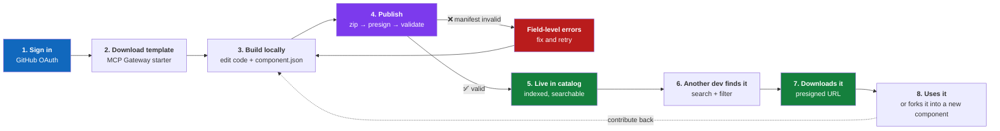
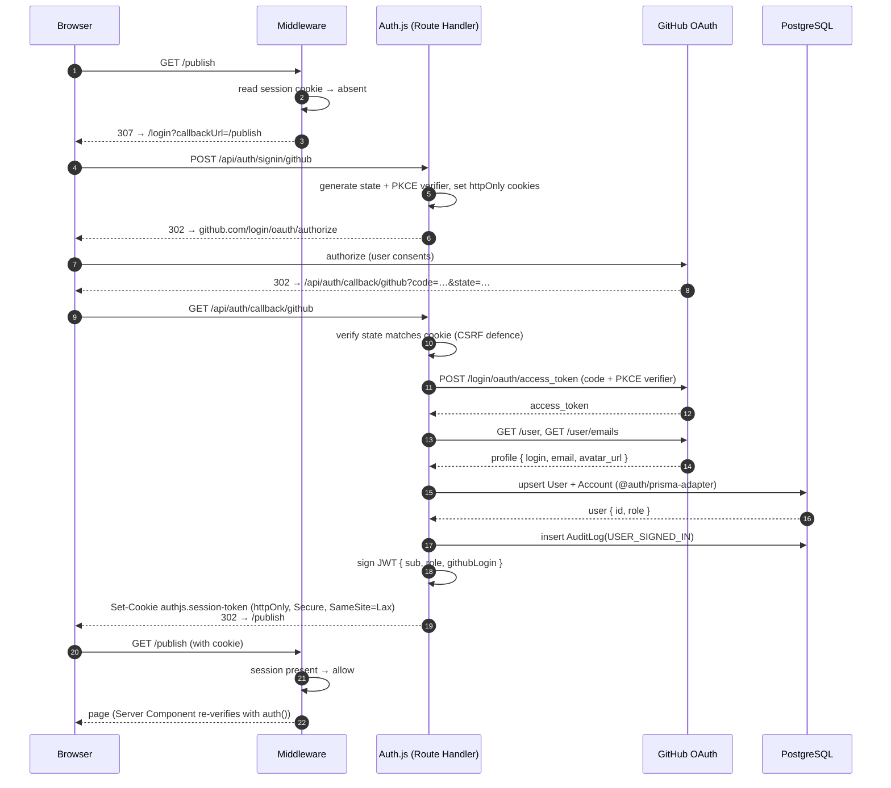
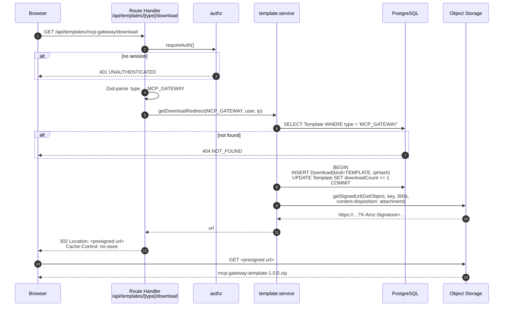
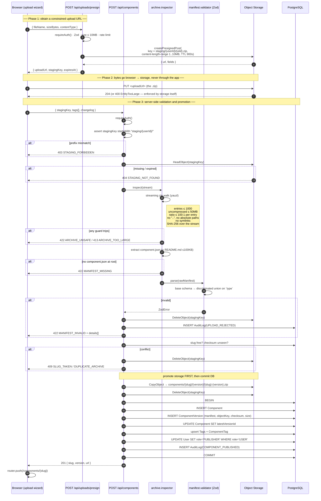
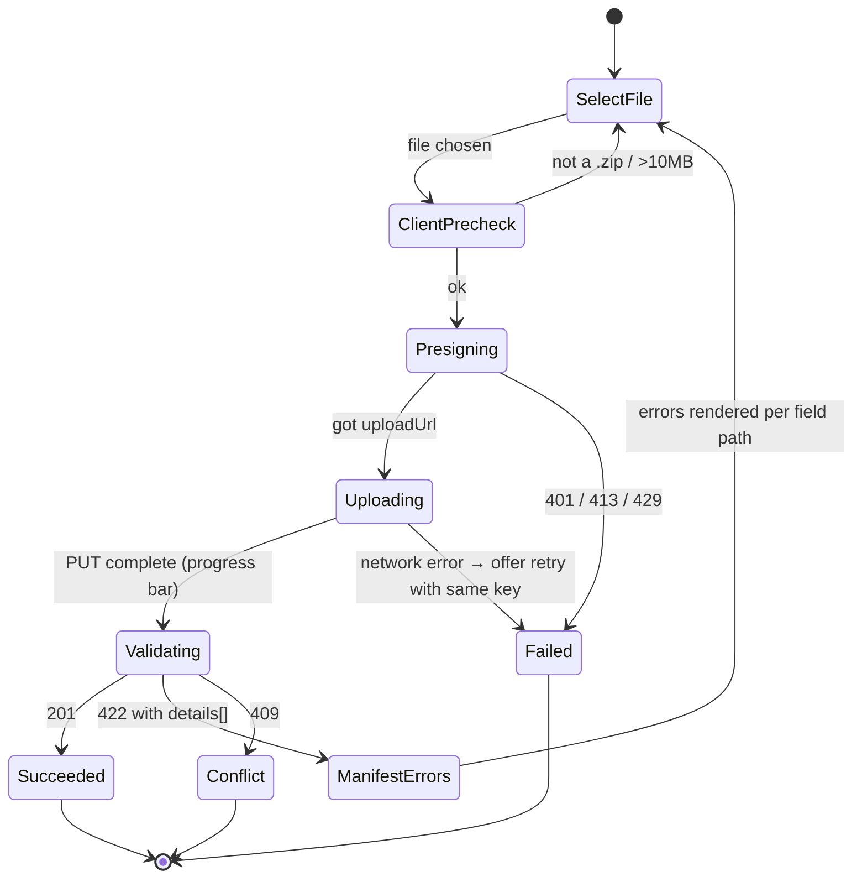
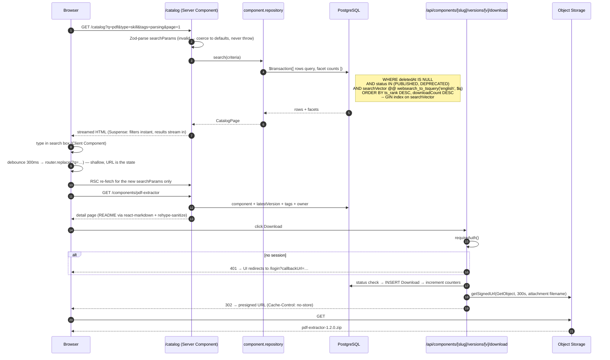
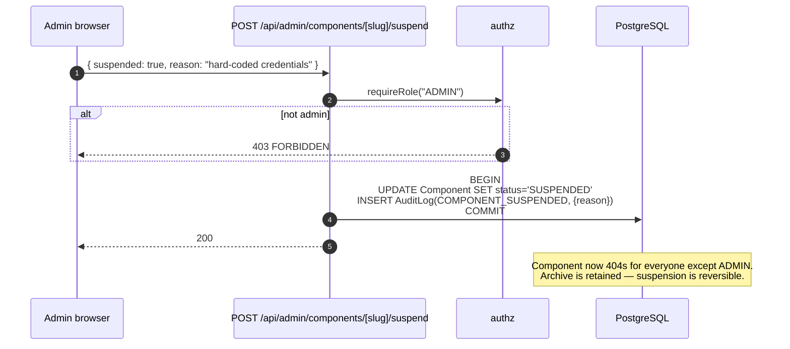
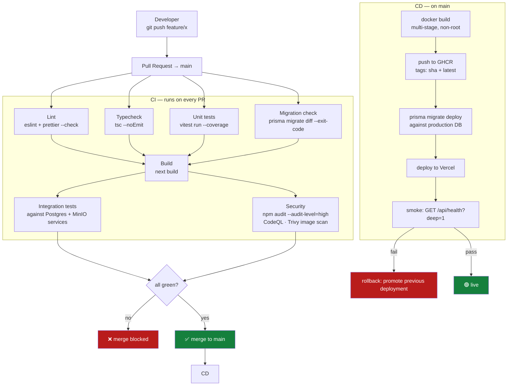

# 04 — End-to-End Sequence Flows

The runtime behaviour of every journey that matters. Read the relevant flow before
implementing it; these diagrams are the specification, not decoration.

---

## Flow 0 — The complete round trip

The single most important picture in this project. Everything else supports it.

**The loop closes** because the templates are themselves manifest-valid components. That
is the property to demo first and lead with in an interview.

---

## Flow 1 — Authentication (GitHub OAuth + RBAC)

### Implementation notes

- **Session strategy: JWT, not database.** Every request would otherwise cost a session
  SELECT. JWT keeps middleware edge-compatible and stateless. Cost: role changes take
  effect on next token refresh (max 24 h). Acceptable — and worth stating as a conscious
  trade-off.
- **`role` is copied into the JWT** in the `jwt` callback on first sign-in, then surfaced
  in the `session` callback. Without this, every authorization check hits the database.
- **Step 21 is not optional.** Middleware checks only _cookie presence_ — it is a
  redirect for UX. Real authorization happens in the Server Component / Route Handler via
  `await auth()`. Treating middleware as the security boundary is the single most common
  Next.js auth vulnerability; see [08 §2.3](08-security-model.md#23-middleware-is-not-a-security-boundary).

---

## Flow 2 — Template download

`Cache-Control: no-store` on the redirect matters: a cached 302 would hand a stale,
expired signature to the next user.

---

## Flow 3 — Component publishing

The most complex flow. Two HTTP round trips to the app plus one direct-to-storage upload.

### Why the ordering in Phase 3 is what it is

| Step                                | Placed here because                                                                                              |
| ----------------------------------- | ---------------------------------------------------------------------------------------------------------------- |
| Prefix check before `HeadObject`    | Cheapest check first, and it prevents probing other users' staging keys via timing                               |
| Safety guards before manifest parse | Never parse content from an archive you have not proven safe                                                     |
| Uniqueness before `CopyObject`      | Avoid writing bytes you are about to reject                                                                      |
| `CopyObject` before `BEGIN`         | A crash mid-way leaves an orphaned object (harmless) rather than a catalog row with no file (a user-visible 404) |
| Everything DB in one transaction    | Component, version, tags, role, and audit either all exist or none do                                            |
| Staging deleted on **both** paths   | Rejected uploads must not linger; the 24 h lifecycle rule is a backstop, not the mechanism                       |

### Client-side wizard states

Client pre-checks are UX, not security. Every one of them is re-checked server-side.

---

## Flow 4 — Discovery & download

**The URL is the state.** Search, filters, sort, and page all live in `searchParams`. This
gives shareable and back-button-correct URLs for free, keeps the results server-rendered
and indexable, and eliminates a client-side state store. It is the App Router idiom and a
visible sign you understand the framework rather than fighting it.

---

## Flow 5 — Admin suspension

---

## Flow 6 — CI/CD

**Migrations run before the deploy, not after.** The new code may depend on the new schema;
the old code must tolerate it. That is why schema changes are additive (expand/contract)
and why `prisma migrate diff --exit-code` in CI catches a schema edited without a
migration — the most common way a solo developer breaks their own deploy.

---

## Flow 7 — Failure handling summary

| Failure                                 | Detected where         | User sees                                           | System does                                                                         |
| --------------------------------------- | ---------------------- | --------------------------------------------------- | ----------------------------------------------------------------------------------- |
| OAuth denied by user                    | Auth.js callback       | `/login?error=AccessDenied` with a readable message | Nothing persisted                                                                   |
| Presign rate limit hit                  | `/api/uploads/presign` | "Too many uploads. Try again in 43 min."            | 429 + `Retry-After`                                                                 |
| Browser→storage PUT fails               | Client                 | Retry button, same staging key reused               | Nothing; key expires in 24 h                                                        |
| Zip bomb                                | `archive.inspector`    | "Archive expands beyond the 50 MB limit."           | Staging deleted; `UPLOAD_REJECTED` logged                                           |
| Manifest invalid                        | `manifest.validator`   | Per-field errors inline in the wizard               | Staging deleted; `UPLOAD_REJECTED` logged                                           |
| Crash after `CopyObject`, before commit | —                      | 500 with a request id                               | Orphaned object; retry succeeds (new checksum check passes since nothing committed) |
| DB unreachable                          | Repository             | Generic 500 + request id                            | pino `error` with request id; `/api/health?deep=1` reports degraded                 |
| Presigned URL expires mid-download      | Storage                | 403 from the storage host                           | User clicks download again; new URL minted                                          |
