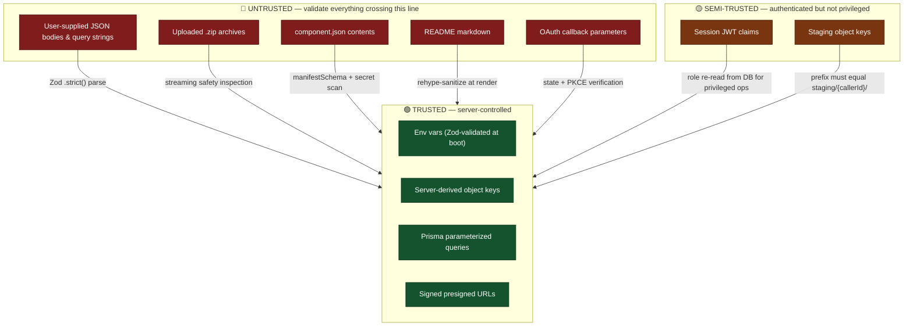

# 08 — Security Model

A registry that accepts uploads from strangers and redistributes them is, structurally, a
malware-delivery service unless you make deliberate choices otherwise. This document is
those choices.

## 1. Trust boundaries



## 2. Authentication & authorization

### 2.1 Authentication

| Control                       | Implementation                                                                                                                    |
| ----------------------------- | --------------------------------------------------------------------------------------------------------------------------------- |
| Protocol                      | OAuth 2.0 authorization-code flow **with PKCE**, via Auth.js v5                                                                   |
| Provider                      | GitHub. No password is ever stored, hashed, reset, or breached.                                                                   |
| CSRF on callback              | `state` parameter, generated server-side, stored in an httpOnly cookie, verified on return. Auth.js does this; do not disable it. |
| Session                       | JWT in an httpOnly, `Secure`, `SameSite=Lax` cookie. 30-day max age, rotated on activity.                                         |
| `SameSite=Lax` (not `Strict`) | `Strict` breaks the OAuth return redirect. `Lax` still blocks cross-site POST CSRF.                                               |
| Secret                        | `AUTH_SECRET` ≥ 32 bytes, distinct per environment, never committed                                                               |
| Transport                     | HTTPS everywhere in production; HSTS with `max-age=31536000; includeSubDomains`                                                   |

### 2.2 Authorization — RBAC

| Role        | Granted                                   | Can                                                                               |
| ----------- | ----------------------------------------- | --------------------------------------------------------------------------------- |
| `USER`      | On first sign-in                          | Browse, search, download components and templates                                 |
| `PUBLISHER` | Automatically on first successful publish | Everything `USER` can, plus publish, version, edit, and delete **own** components |
| `ADMIN`     | Manually, via a one-off script            | Everything, plus suspend any component and read the audit log                     |

Three guards, and every protected path uses exactly one of them:

```ts
// src/server/auth/guards.ts
export async function requireAuth(): Promise<SessionUser> {
  const session = await auth();
  if (!session?.user) throw new AppError("UNAUTHENTICATED", 401);
  return session.user;
}

export async function requireRole(role: Role): Promise<SessionUser> {
  const user = await requireAuth();
  if (!hasAtLeast(user.role, role)) throw new AppError("FORBIDDEN", 403);
  return user;
}

export async function requireOwnership(slug: string): Promise<SessionUser> {
  const user = await requireAuth();
  const owner = await componentRepo.findOwnerId(slug);
  if (!owner) throw new AppError("NOT_FOUND", 404); // not 403 — see below
  if (owner !== user.id && user.role !== "ADMIN") throw new AppError("NOT_FOUND", 404); // ← deliberate
  return user;
}
```

> **Why `requireOwnership` returns 404, not 403.** A 403 confirms the resource exists,
> which turns the endpoint into an enumeration oracle. Returning 404 for "exists but not
> yours" leaks nothing. Small choice; reviewers notice it.

**Role escalation is never taken from the JWT alone.** For `ADMIN`-only operations, re-read
the role from the database. A JWT minted before a demotion stays valid until it expires;
for destructive operations that window is unacceptable. Read-only role checks may use the
token.

### 2.3 Middleware is NOT a security boundary

The single most common Next.js App Router vulnerability, and the one most worth being able
to articulate:

```ts
// middleware.ts — this is a UX redirect. Nothing more.
export async function middleware(req: NextRequest) {
  const hasCookie = Boolean(req.cookies.get("authjs.session-token"));
  if (!hasCookie && isProtectedPath(req.nextUrl.pathname)) {
    return NextResponse.redirect(new URL(`/login?callbackUrl=${…}`, req.url));
  }
  return NextResponse.next();
}
```

Middleware checks _cookie presence_, not validity, and runs before the route — but a
`fetch` straight to `/api/components` with a crafted cookie bypasses the page entirely.
**Therefore every Route Handler, Server Action, and protected Server Component calls
`requireAuth()` / `requireRole()` itself.** Middleware improves the experience; the guard
provides the security. Never conflate them.

## 3. Input validation

**Rule: every external input is parsed by a Zod schema before any other code touches it.**
Not validated _after_ — parsed _first_, so the rest of the function works with a typed,
proven-safe value.

| Surface              | Schema location              | Notes                                                                                                                           |
| -------------------- | ---------------------------- | ------------------------------------------------------------------------------------------------------------------------------- |
| Route Handler bodies | `domain/schemas/api/*.ts`    | `.strict()` — unknown keys rejected                                                                                             |
| Query strings        | same                         | Coerce and clamp; never throw on a bad `?page=abc`, fall back to defaults                                                       |
| Server Action inputs | same                         | Server Actions are **public HTTP endpoints**. They need identical auth + validation to a Route Handler. Easy to forget; costly. |
| Route params         | inline                       | Slugs against the same regex the manifest uses                                                                                  |
| `component.json`     | `domain/schemas/manifest.ts` | See [06](06-component-manifest-spec.md)                                                                                         |
| Env vars             | `lib/env.ts`                 | Parsed at boot; process refuses to start if invalid                                                                             |

## 4. Upload pipeline threats

> These guards were **kept in the v1 core** despite "upload scanning" being deselected as
> a differentiator. Rationale in [00 §3](00-overview.md#3-non-goals--explicitly-out-of-scope-for-v1).
> Total cost: roughly 80 lines in one file.

| #   | Threat                                | Attack                                                                                                      | Control                                                                                                                          | Failure code                     |
| --- | ------------------------------------- | ----------------------------------------------------------------------------------------------------------- | -------------------------------------------------------------------------------------------------------------------------------- | -------------------------------- |
| 1   | **Zip-slip** (path traversal)         | Entry named `../../etc/passwd` or `C:\Windows\…`. The portal never extracts to disk, but a _consumer_ will. | Reject any entry that is absolute, contains `..` after normalization, or has a Windows drive prefix.                             | `ARCHIVE_UNSAFE`                 |
| 2   | **Decompression bomb**                | 1 MB zip expanding to 50 GB                                                                                 | Enforce total uncompressed ≤ 50 MB **and** per-entry ratio ≤ 100:1. Abort the stream on breach — never finish reading.           | `ARCHIVE_UNSAFE`                 |
| 3   | **Entry-count flood**                 | 1M zero-byte entries exhausting memory in the entry table                                                   | Cap at 1000 entries                                                                                                              | `ARCHIVE_UNSAFE`                 |
| 4   | **Symlink escape**                    | Symlink entry pointing at `/etc/shadow`, resolved by a consumer on extract                                  | Reject any entry whose external attributes mark it a symlink                                                                     | `ARCHIVE_UNSAFE`                 |
| 5   | **Oversize upload**                   | 5 GB PUT filling the bucket                                                                                 | Enforced twice: `content-length-range` in the presigned POST (storage rejects it) **and** `HeadObject` size re-check server-side | `ARCHIVE_TOO_LARGE`              |
| 6   | **Cross-user staging access**         | User A publishes User B's staged object                                                                     | `stagingKey` MUST start with `staging/{callerId}/`, checked before any storage call                                              | `STAGING_FORBIDDEN`              |
| 7   | **Client-chosen object key**          | Key `../../templates/skill/1.0.0/skill-template-1.0.0.zip` overwrites an official template                  | The client **never** supplies a key. The server generates `staging/{userId}/{ulid}.zip`.                                         | n/a — impossible by construction |
| 8   | **Secrets in a manifest**             | A real API key pasted into `auth.envVars`                                                                   | Pattern scan on manifest strings; reject and name the _pattern_, never echo the value                                            | `MANIFEST_INVALID`               |
| 9   | **Stored XSS via README**             | `` in README.md                                                                        | `react-markdown` + `rehype-sanitize`. **Never** `dangerouslySetInnerHTML`. No raw HTML passthrough.                              | rendered inert                   |
| 10  | **XSS via manifest URLs**             | `"homepage": "javascript:alert(1)"`                                                                         | `httpsUrl` schema — `https://` scheme only                                                                                       | `MANIFEST_INVALID`               |
| 11  | **Publish flooding**                  | Scripted mass publishing                                                                                    | Rate limit: 10 presigns/h, 20 publishes/day, per user                                                                            | `RATE_LIMITED`                   |
| 12  | **Duplicate spam**                    | Same archive published under 50 slugs                                                                       | Unique constraint on `checksumSha256`                                                                                            | `DUPLICATE_ARCHIVE`              |
| 13  | **Presigned URL leakage**             | A download URL shared publicly                                                                              | 300 s TTL; single object; `Cache-Control: no-store` on the redirect                                                              | expires                          |
| 14  | **Malicious code inside the archive** | A component that exfiltrates data when run                                                                  | ⚠️ **Not mitigated in v1.** Documented explicitly below.                                                                         | —                                |

### 4.1 The honest limitation

> **The portal does not execute, sandbox, or inspect the _behaviour_ of uploaded code.**
> It validates structure, not intent. A published component can contain arbitrary code
> and a consumer runs it at their own risk — exactly as with npm or PyPI.
>
> **v1 mitigations:** every component is attributable to a GitHub identity; `ADMIN` can
> suspend within seconds; every publish is in the audit log; checksums let a consumer
> verify what they got.
>
> **v2 path:** static analysis on upload (`semgrep`), dependency-vulnerability scanning of
> declared `runtime.dependencies`, a `verified publisher` badge, and community reporting.

Stating a limitation plainly, with mitigations and a roadmap, is a _stronger_ security
posture than a vague claim of safety. Say this sentence in the interview.

### 4.2 The inspector — implementation shape

```ts
// src/server/services/archive.inspector.ts
export async function inspectArchive(
  stream: Readable,
  limits: Limits,
): Promise<InspectionResult> {
  let entries = 0,
    uncompressed = 0;
  const hash = createHash("sha256");
  // ...pipe through hash while yauzl walks entries...

  for await (const entry of walk(stream)) {
    if (++entries > limits.maxEntries) throw unsafe("TOO_MANY_ENTRIES");

    const name = entry.fileName.replace(/\\/g, "/");
    if (name.startsWith("/") || /^[A-Za-z]:/.test(name)) throw unsafe("ABSOLUTE_PATH");
    if (name.split("/").includes("..")) throw unsafe("PATH_TRAVERSAL");
    if (isSymlink(entry.externalFileAttributes)) throw unsafe("SYMLINK");

    uncompressed += entry.uncompressedSize;
    if (uncompressed > limits.maxUncompressed) throw unsafe("BOMB_TOTAL");
    if (
      entry.compressedSize > 0 &&
      entry.uncompressedSize / entry.compressedSize > limits.maxRatio
    )
      throw unsafe("BOMB_RATIO");

    if (name === "component.json") manifestRaw = await readCapped(entry, 64 * 1024);
    if (name === "README.md") readme = await readCapped(entry, 100 * 1024);
  }
  return {
    checksum: hash.digest("hex"),
    entries,
    uncompressed,
    manifestRaw,
    readme,
    paths,
  };
}
```

Two properties matter: it is **streaming** (nothing large is ever buffered) and it
**aborts on the first breach** (a bomb is never fully read). `adm-zip` cannot do either —
that is the whole reason for choosing `yauzl`.

**These are the easiest high-value unit tests in the project.** Build the malicious
fixtures by hand and assert each rejection. Six tests, and they are the ones to show
someone.

## 5. Data protection

| Data           | Handling                                                                                                       |
| -------------- | -------------------------------------------------------------------------------------------------------------- |
| Passwords      | **None exist.** OAuth only. Nothing to breach.                                                                 |
| OAuth tokens   | Stored in `Account`, server-side only, never sent to the client                                                |
| Email          | Stored; shown only to the owner and admins; never in a public API response                                     |
| IP addresses   | **Never stored raw.** `sha256(ip + DOWNLOAD_IP_SALT)`. Supports abuse detection with no personal data at rest. |
| Session cookie | httpOnly (JS cannot read it), Secure, SameSite=Lax                                                             |
| Secrets        | Env vars only. Zod-split server/client so an S3 key cannot reach the bundle.                                   |
| Deletion       | Soft delete keeps audit integrity; a hard-delete script exists for a genuine GDPR erasure request              |

## 6. Security headers

`next.config.ts`:

```ts
const securityHeaders = [
  { key: "X-Content-Type-Options", value: "nosniff" },
  { key: "X-Frame-Options", value: "DENY" },
  { key: "Referrer-Policy", value: "strict-origin-when-cross-origin" },
  { key: "Permissions-Policy", value: "camera=(), microphone=(), geolocation=()" },
  { key: "Strict-Transport-Security", value: "max-age=31536000; includeSubDomains" },
  {
    key: "Content-Security-Policy",
    value: [
      "default-src 'self'",
      "script-src 'self' 'unsafe-inline'", // Next inline bootstrap; tighten with nonces later
      "style-src 'self' 'unsafe-inline'",
      "img-src 'self' data: https://avatars.githubusercontent.com",
      "connect-src 'self' " + process.env.S3_PUBLIC_ENDPOINT, // presigned PUT target
      "frame-ancestors 'none'",
      "base-uri 'self'",
      "form-action 'self'",
    ].join("; "),
  },
];
```

Two notes worth making rather than hiding:

- `connect-src` **must** include the storage origin, or the direct browser upload is
  blocked by CSP. This is a common self-inflicted outage.
- `'unsafe-inline'` in `script-src` is a real weakening. Nonce-based CSP with the App
  Router is a known-fiddly upgrade — record it as a deliberate v1 compromise in an ADR
  rather than pretending the header is airtight.

## 7. Dependency & supply chain

| Control            | Tool                                     | Where                         |
| ------------------ | ---------------------------------------- | ----------------------------- |
| Lockfile committed | `package-lock.json`                      | repo                          |
| Vulnerability scan | `npm audit --audit-level=high`           | CI, blocking                  |
| Automated updates  | Dependabot, weekly, grouped              | `.github/dependabot.yml`      |
| Static analysis    | GitHub CodeQL                            | CI, on PR                     |
| Secret scanning    | GitHub secret scanning + push protection | repo settings                 |
| Container scan     | Trivy on the built image                 | CI, blocking on HIGH/CRITICAL |
| Pinned versions    | Exact for `next-auth`; caret elsewhere   | `package.json`                |

## 8. Incident response

For a portfolio project, "we would investigate" is a weak answer. A three-line runbook is
a strong one:

| Incident                      | Immediate action                                                                         | Follow-up                                                                                       |
| ----------------------------- | ---------------------------------------------------------------------------------------- | ----------------------------------------------------------------------------------------------- |
| Malicious component reported  | `POST /api/admin/components/:slug/suspend` — invisible and undownloadable within seconds | Query `AuditLog` for the publisher's other components; check `Download` rows for who fetched it |
| Credential leaked in the repo | Rotate in the provider, update Vercel env, redeploy                                      | Purge history with `git filter-repo`; enable push protection                                    |
| Storage bucket exposed        | Set access to private; rotate S3 keys                                                    | Review R2 access logs                                                                           |
| Abusive upload flood          | Lower the rate limit via env var; suspend the account                                    | Add per-IP presign limiting                                                                     |

`AuditLog` is what makes every "follow-up" column answerable instead of aspirational. That
is why it exists.

## 9. Pre-launch checklist

- [ ] `.env.local` is gitignored and has never been committed (`git log --all -- .env.local` is empty)
- [ ] `AUTH_SECRET` differs between dev and production
- [ ] Storage bucket is **private**; no public URL resolves
- [ ] Bucket CORS allows only the production origin
- [ ] Staging lifecycle rule is active (verify by listing after 24 h)
- [ ] Every mutating Route Handler and Server Action calls a guard — grep for `export async function POST` and check each one
- [ ] No `dangerouslySetInnerHTML` anywhere (`grep -r dangerouslySetInnerHTML src/` is empty)
- [ ] 500 responses contain no stack traces (force an error in production and read the body)
- [ ] Security headers present (check with `curl -I` or securityheaders.com)
- [ ] Rate limits verified by actually exceeding one
- [ ] The six malicious-archive fixtures are all rejected in CI
- [ ] An `ADMIN` account exists and suspension works end to end
