# 09 — Implementation Plan

**The build order.** Six phases, ~17 working days. Every phase ends with something
demoable — if you run out of time mid-project, you still have a coherent thing to show.

> **How to use this with a coding agent.** Each task carries its spec reference and
> acceptance criteria. Give the agent **one task at a time**, with the referenced doc
> section. Do not paste this whole file and say "build it" — you will get plausible code
> that does not match the contract. Prompt template at §9.

---

## Phase map

```mermaid
gantt
    title 17-day build — each phase ends demoable
    dateFormat X
    axisFormat D%d

    section P0 Foundation
    Scaffold · Docker · Prisma · CI skeleton    :p0, 0, 2d

    section P1 Auth
    Auth.js · GitHub OAuth · RBAC · guards       :p1, after p0, 2d

    section P2 Data + Templates
    Schema · storage service · 4 templates       :p2, after p1, 3d

    section P3 Manifest + Publish
    Zod spec · inspector · presign · wizard      :crit, p3, after p2, 4d

    section P4 Catalog
    Search · detail · download · dashboard       :p4, after p3, 3d

    section P5 Harden + Ship
    Docker · CI/CD · deploy · tests · README     :p5, after p4, 3d
```



**Phase 3 is the critical path.** It is the differentiator, the hardest code, and the
demo. If a phase must be cut, cut scope from P4 or P5 — never from P3.

### Definition of Done — applies to every task

1. `npm run lint` clean · `npm run typecheck` clean
2. No `any`, no `@ts-expect-error` without a comment explaining why
3. Every external input Zod-parsed before use
4. Every protected path calls a guard from `server/auth/guards.ts`
5. Committed with a Conventional Commit message
6. If it changes behaviour described in `docs/`, the doc is updated in the **same commit**

---

## Phase 0 — Foundation (Days 1–2)

**Goal:** `docker compose up` + `npm run dev` produces a running, typechecked, linted app
connected to Postgres and MinIO.

| #    | Task                                                                                                                                                                              | Acceptance criteria                                             | Spec                                                                     |
| ---- | --------------------------------------------------------------------------------------------------------------------------------------------------------------------------------- | --------------------------------------------------------------- | ------------------------------------------------------------------------ |
| 0.1  | `git init`; scaffold `npx create-next-app@latest` — TypeScript, App Router, Tailwind, ESLint, `src/`, alias `@/*`                                                                 | `npm run dev` serves localhost:3000                             | [01 §7](01-architecture.md#7-technology-choices-with-the-version-pinned) |
| 0.2  | **⚠️ Toolchain gate.** Verify TypeScript 7 + ESLint 10 + Next 16 work together. If anything breaks, drop TS to latest 6.x and write [ADR-009](adr/ADR-009-toolchain-versions.md). | `tsc --noEmit` and `eslint .` both exit 0                       | [01 §7](01-architecture.md#7-technology-choices-with-the-version-pinned) |
| 0.3  | Create the folder skeleton from [01 §4](01-architecture.md#4-module-boundaries-and-the-dependency-rule), each dir with a `.gitkeep`                                               | Structure matches exactly                                       | [01 §4](01-architecture.md#4-module-boundaries-and-the-dependency-rule)  |
| 0.4  | ESLint flat config + `import/no-restricted-paths` enforcing the dependency rule; Prettier; `.editorconfig`                                                                        | An import from `app/` to `@prisma/client` fails lint            | [01 §4](01-architecture.md#4-module-boundaries-and-the-dependency-rule)  |
| 0.5  | `docker-compose.yml` — postgres + minio + minio-init                                                                                                                              | `docker compose up -d`; both healthy; bucket `ai-portal` exists | [05 §2.1](05-infrastructure.md#21-docker-composeyml)                     |
| 0.6  | Set MinIO CORS for `localhost:3000`                                                                                                                                               | `mc cors get` shows the rule                                    | [05 §2.2](05-infrastructure.md#22-browser-cors-on-minio)                 |
| 0.7  | `.env.example` + `src/lib/env.ts` Zod boot validation                                                                                                                             | Deleting `AUTH_SECRET` crashes at startup with a clear message  | [05 §2.3](05-infrastructure.md#23-environment-variables)                 |
| 0.8  | `prisma init`; `User` model only; first migration; `src/server/db.ts` singleton                                                                                                   | `npx prisma migrate dev` succeeds; Studio shows the table       | [02 §3](02-data-model.md#3-prisma-schema)                                |
| 0.9  | `src/lib/logger.ts` (pino) + `src/domain/errors.ts` (`AppError`, code taxonomy)                                                                                                   | `logger.info` emits JSON with a `requestId` field               | [03 §1.2](03-api-contract.md#12-error-code-taxonomy)                     |
| 0.10 | `GET /api/health` (shallow + `?deep=1`)                                                                                                                                           | `curl localhost:3000/api/health` → 200 JSON                     | [03 §3.1](03-api-contract.md#31-get-apihealth-)                          |
| 0.11 | `.github/workflows/ci.yml` — install, lint, typecheck, build                                                                                                                      | Green on first push                                             | [10 §2](10-cicd-and-deployment.md#2-github-actions--ci)                  |
| 0.12 | `npm scripts`: `dev build start lint typecheck test db:migrate db:seed db:studio docker:up docker:down`                                                                           | All run                                                         | —                                                                        |

**Demo:** health endpoint returns 200; CI is green; `docker compose ps` shows two healthy
services.

> **Day-1 pitfalls:** Docker Desktop needs WSL2 enabled on Windows 11 — sort this out
> before anything else. Port 5432 conflicts with a local Postgres install (change the host
> port to `5433` if so). Do not skip 0.2; discovering a toolchain incompatibility on day
> 14 is the worst outcome in this plan.

---

## Phase 1 — Authentication & RBAC (Days 3–4)

**Goal:** sign in with GitHub, see your avatar, and get bounced from `/publish` when
logged out.

| #    | Task                                                                                                                                               | Acceptance criteria                                       | Spec                                                                        |
| ---- | -------------------------------------------------------------------------------------------------------------------------------------------------- | --------------------------------------------------------- | --------------------------------------------------------------------------- |
| 1.1  | Create the dev GitHub OAuth app; put the id/secret in `.env.local`                                                                                 | Callback `http://localhost:3000/api/auth/callback/github` | [05 §2.4](05-infrastructure.md#24-first-run-sequence)                       |
| 1.2  | Install `next-auth@5.0.0-beta.32` (**exact**) + `@auth/prisma-adapter`                                                                             | Pinned without a caret in `package.json`                  | [ADR-004](adr/ADR-004-authentication.md)                                    |
| 1.3  | Add `Account`, `Session`, `VerificationToken`, `Role` enum; migrate                                                                                | Tables exist with the adapter's exact field names         | [02 §3](02-data-model.md#3-prisma-schema)                                   |
| 1.4  | `src/server/auth/config.ts` — GitHub provider, Prisma adapter, JWT strategy, `jwt`/`session` callbacks putting `role` + `githubLogin` on the token | `await auth()` returns `session.user.role`                | [04 Flow 1](04-sequence-flows.md#flow-1--authentication-github-oauth--rbac) |
| 1.5  | `app/api/auth/[...nextauth]/route.ts`                                                                                                              | `/api/auth/signin` renders                                | —                                                                           |
| 1.6  | `src/server/auth/guards.ts` — `requireAuth`, `requireRole`, `requireOwnership` (404-not-403)                                                       | Unit tests cover all three                                | [08 §2.2](08-security-model.md#22-authorization--rbac)                      |
| 1.7  | `middleware.ts` — cookie-presence redirect + security headers. **Comment that it is not a security boundary.**                                     | Logged-out `/publish` → `/login?callbackUrl=/publish`     | [08 §2.3](08-security-model.md#23-middleware-is-not-a-security-boundary)    |
| 1.8  | `/login` page + header auth state (avatar, dropdown, sign out)                                                                                     | Round trip works; avatar renders                          | —                                                                           |
| 1.9  | `AuditLog` model + write `USER_SIGNED_IN` on `signIn` event                                                                                        | Row appears in Studio after login                         | [02 §5](02-data-model.md#5-audit-action-vocabulary)                         |
| 1.10 | Install shadcn/ui; add `button card input badge dropdown-menu avatar dialog toast skeleton tabs select`                                            | Components render                                         | —                                                                           |
| 1.11 | `scripts/make-admin.ts` — promote a user by email                                                                                                  | `npx tsx scripts/make-admin.ts you@example.com` works     | —                                                                           |

**Demo:** click "Sign in with GitHub", get redirected, come back authenticated, see your
avatar, and get redirected away from `/publish` after signing out.

> **Pitfalls:** `AUTH_TRUST_HOST=true` is required or callbacks fail. `AUTH_SECRET` must
> be ≥32 bytes (`npx auth secret`). Auth.js v5 config lives in a root `auth.ts` re-exported
> as `{ handlers, auth, signIn, signOut }` — v4 tutorials will mislead you; use the v5
> docs only.

---

## Phase 2 — Data model, storage & templates (Days 5–7)

**Goal:** four real template zips live in MinIO, listed at `/templates`, downloadable by
authenticated users.

| #    | Task                                                                                                                                                                                      | Acceptance criteria                                                                                  | Spec                                                        |
| ---- | ----------------------------------------------------------------------------------------------------------------------------------------------------------------------------------------- | ---------------------------------------------------------------------------------------------------- | ----------------------------------------------------------- |
| 2.1  | Complete `schema.prisma`: `Component`, `ComponentVersion`, `Tag`, `ComponentTag`, `Template`, `Download`, enums                                                                           | `prisma validate` passes                                                                             | [02 §3](02-data-model.md#3-prisma-schema)                   |
| 2.2  | Hand-written migration: generated `tsvector` column, GIN index, `pg_trgm`                                                                                                                 | `\d "Component"` shows the column and index                                                          | [02 §4](02-data-model.md#4-full-text-search)                |
| 2.3  | `src/server/storage/storage.service.ts` — S3 client, `putObject`, `headObject`, `copyObject`, `deleteObject`, `getSignedDownloadUrl`, `createPresignedUpload`. Path-style toggled by env. | Integration test round-trips an object through MinIO                                                 | [05 §2.3](05-infrastructure.md#23-environment-variables)    |
| 2.4  | `src/domain/schemas/manifest.ts` — **the full Zod union**                                                                                                                                 | Unit tests: one valid + one invalid fixture per type                                                 | [06 §5](06-component-manifest-spec.md#5-zod-implementation) |
| 2.5  | Author the four templates under `templates/`                                                                                                                                              | Each has manifest, README, src, tests, `.env.example`, `scripts/pack.mjs`, `docs/GETTING-STARTED.md` | [07 §3](07-template-catalog.md#3-the-four-templates)        |
| 2.6  | `scripts/build-templates.mts` — validate against the real schema, assert declared paths exist, zip **contents**, checksum (upload moves to the seed, 2.7)                                 | `npm run templates:verify` exits non-zero on a broken template; `templates:build` emits 4 archives   | [07 §4](07-template-catalog.md#4-build--publish-pipeline)   |
| 2.7  | `prisma/seed.ts` — idempotent: 20 tags, 4 templates, dev-only demo data                                                                                                                   | `npm run db:seed` twice → no duplicates                                                              | [02 §6](02-data-model.md#6-seed-data)                       |
| 2.8  | `GET /api/templates` and `GET /api/templates/:type/download`                                                                                                                              | Download 302s to a presigned URL; the file opens                                                     | [03 §3.2–3.3](03-api-contract.md#32-get-apitemplates-)      |
| 2.9  | `/templates` page — 4 cards + the 3-step strip; sign-in gate on download                                                                                                                  | Renders; unauthenticated click prompts login                                                         | [07 §5](07-template-catalog.md#5-templates-page)            |
| 2.10 | `npm run templates:verify` in CI                                                                                                                                                          | A deliberately broken template fails CI                                                              | [07 §4](07-template-catalog.md#4-build--publish-pipeline)   |

**Demo:** download the MCP Gateway template, unzip it, `npm install && npm test` → green.

> **Pitfalls:** MinIO needs `forcePathStyle: true` — without it the SDK builds
> `http://ai-portal.localhost:9000` and everything 403s. Zip the folder **contents**;
> verify with `unzip -l` that `component.json` is at the root. `@aws-sdk/client-s3` v3
> streams are `ReadableStream`, not Node streams — you may need
> `Readable.fromWeb(body.transformToWebStream())`.

---

## Phase 3 — Manifest validation & publishing ⭐ CRITICAL PATH (Days 8–11)

**Goal:** upload a zip through the wizard; valid ones appear in the catalog, invalid ones
produce precise field-level errors.

| #    | Task                                                                                                                                          | Acceptance criteria                                              | Spec                                                                          |
| ---- | --------------------------------------------------------------------------------------------------------------------------------------------- | ---------------------------------------------------------------- | ----------------------------------------------------------------------------- |
| 3.1  | `archive.inspector.ts` — streaming yauzl walk with all six safety guards + SHA-256 + `component.json` and `README.md` extraction              | 6 malicious fixtures each rejected with the right code           | [08 §4.2](08-security-model.md#42-the-inspector--implementation-shape)        |
| 3.2  | Build the fixtures: `zip-slip.zip`, `bomb.zip`, `symlink.zip`, `too-many-entries.zip`, `no-manifest.zip`, `nested-manifest.zip`               | Committed under `tests/fixtures/archives/`                       | [08 §4](08-security-model.md#4-upload-pipeline-threats)                       |
| 3.3  | `manifest.validator.ts` — Zod parse + `toFieldErrors` + cross-field checks (§3.2 of doc 06) + secret scan                                     | Invalid manifest yields `details[]` with dotted paths            | [06 §5.1, §7](06-component-manifest-spec.md#51-turning-zoderror-into-details) |
| 3.4  | The "nested manifest" hint — detect `*/component.json` one level deep and return the actionable message                                       | Message names the found path and suggests `npm run pack`         | [07 §2](07-template-catalog.md#2-shared-skeleton)                             |
| 3.5  | `POST /api/uploads/presign` — auth, size cap, filename regex, server-derived key, `content-length-range`, rate limit                          | Oversize PUT rejected by MinIO itself, not just the client       | [03 §3.6](03-api-contract.md#36-post-apiuploadspresign-)                      |
| 3.6  | `RateLimit` model + `rateLimit.service.ts` (atomic upsert)                                                                                    | 11th presign in an hour → 429 with `Retry-After`                 | [03 §4](03-api-contract.md#4-rate-limits)                                     |
| 3.7  | `component.service.publish()` — the full pipeline in [04 Flow 3](04-sequence-flows.md#flow-3--component-publishing) ordering                  | Staging deleted on **both** success and failure                  | [04 Flow 3](04-sequence-flows.md#flow-3--component-publishing)                |
| 3.8  | `POST /api/components`                                                                                                                        | 201 on valid; 422 with `details[]` on invalid; 409 on duplicates | [03 §3.7](03-api-contract.md#37-post-apicomponents--publish-a-new-component)  |
| 3.9  | `POST /api/components/:slug/versions` — ownership, name/type match, semver strictly increasing, `latestVersionId` moves                       | Publishing `0.9.0` after `1.0.0` → `VERSION_NOT_INCREASING`      | [03 §3.8](03-api-contract.md#38-post-apicomponentsslugversions-)              |
| 3.10 | `/publish` wizard — dropzone, client precheck, progress bar, the state machine in [04 Flow 3](04-sequence-flows.md#client-side-wizard-states) | Progress bar reflects real XHR progress                          | [04 Flow 3](04-sequence-flows.md#client-side-wizard-states)                   |
| 3.11 | Error rendering — map `details[].path` to a field list with the offending path highlighted                                                    | A 3-error manifest shows 3 distinct, readable messages           | [03 §1.1](03-api-contract.md#11-error-envelope--every-non-2xx-response)       |
| 3.12 | `/dashboard` — my components, status badges, download counts, "Publish new version"                                                           | Lists owned components including suspended ones                  | [03 §3.13](03-api-contract.md#313-get-apime--get-apimecomponents-)            |

**Demo — this is the money shot, rehearse it:**

1. Download the Skill template → publish it unchanged → **201, live in the catalog**.
2. Break `version` to `"1.0"`, delete `runtime.language`, re-zip → publish →
   **422 with two precise field errors**.
3. Fix them, republish → success.
4. Try `zip-slip.zip` → **`ARCHIVE_UNSAFE`**.

> **Pitfalls:** `fetch` cannot report upload progress — use `XMLHttpRequest` for the PUT.
> CORS on MinIO must expose `ETag`. Delete the staging object on the rejection path too;
> forgetting this is the most common bug in this phase. Test the transaction by throwing
> deliberately after `CopyObject` and confirming no half-written component exists.

---

## Phase 4 — Catalog & discovery (Days 12–14)

**Goal:** a catalog that looks like a product.

| #    | Task                                                                                                    | Acceptance criteria                                    | Spec                                                                           |
| ---- | ------------------------------------------------------------------------------------------------------- | ------------------------------------------------------ | ------------------------------------------------------------------------------ |
| 4.1  | `component.repository.search()` — raw FTS query with facets, both in one `$transaction`                 | p95 < 300 ms with 1000 seeded rows                     | [02 §4](02-data-model.md#4-full-text-search)                                   |
| 4.2  | `GET /api/components` — full query schema, pagination, facets                                           | Matches the documented response exactly                | [03 §3.4](03-api-contract.md#34-get-apicomponents--catalog-search)             |
| 4.3  | `/catalog` Server Component driven by `searchParams`                                                    | Refreshing a filtered URL reproduces the same results  | [04 Flow 4](04-sequence-flows.md#flow-4--discovery--download)                  |
| 4.4  | Client filter sidebar — type checkboxes, tag multi-select, sort; writes to the URL via `router.replace` | Back button restores the previous filter state         | [04 Flow 4](04-sequence-flows.md#flow-4--discovery--download)                  |
| 4.5  | Search box, 300 ms debounced, URL-driven                                                                | Typing does not remount the results list               | —                                                                              |
| 4.6  | `ComponentCard` — type badge, name, summary, tags, downloads, owner avatar                              | Consistent height; no layout shift                     | —                                                                              |
| 4.7  | Loading + empty states — `loading.tsx` skeletons, "no results" with a clear-filters action              | No spinner-on-blank-page anywhere                      | —                                                                              |
| 4.8  | `GET /api/components/:slug` + `/components/[slug]` detail page                                          | Renders README, manifest viewer, versions, owner, tags | [03 §3.5](03-api-contract.md#35-get-apicomponentsslug-)                        |
| 4.9  | README rendering via `react-markdown` + `rehype-sanitize` + syntax highlighting                         | `` renders inert           | [08 §4](08-security-model.md#4-upload-pipeline-threats)                        |
| 4.10 | Manifest viewer — collapsible, syntax-highlighted, copy button                                          | Shows the stored manifest for the selected version     | —                                                                              |
| 4.11 | `GET …/versions/:version/download` — auth, status check, count, 302                                     | File downloads with the right filename                 | [03 §3.9](03-api-contract.md#39-get-apicomponentsslugversionsversiondownload-) |
| 4.12 | `PATCH` / `DELETE /api/components/:slug` + dashboard edit dialog                                        | Immutable fields rejected with 400                     | [03 §3.10–3.11](03-api-contract.md#310-patch-apicomponentsslug-)               |
| 4.13 | Admin suspend route + a minimal `/admin` table                                                          | Suspended component 404s for non-admins                | [03 §3.12](03-api-contract.md#312-post-apiadmincomponentsslugsuspend-)         |
| 4.14 | Landing page — hero, the 3-step strip, 4 type cards, featured components, stats                         | Communicates the product in 5 seconds                  | —                                                                              |
| 4.15 | `generateMetadata` for OG tags on catalog and detail pages                                              | Link preview renders correctly                         | [01 §6](01-architecture.md#6-rendering-strategy)                               |

**Demo:** search "pdf", filter to Skills, sort by downloads, open a detail page, download.

---

## Phase 5 — Harden & ship (Days 15–17)

**Goal:** a live public URL, a green pipeline, and a README a stranger can follow.

| #    | Task                                                                                                                     | Acceptance criteria                                          | Spec                                                       |
| ---- | ------------------------------------------------------------------------------------------------------------------------ | ------------------------------------------------------------ | ---------------------------------------------------------- |
| 5.1  | `output: "standalone"`; multi-stage `Dockerfile`; `.dockerignore`                                                        | `docker build` then `docker run -p 3000:3000` serves the app | [05 §5](05-infrastructure.md#5-production-dockerfile)      |
| 5.2  | Verify the container runs as non-root                                                                                    | `docker exec … whoami` → `nextjs`                            | [05 §5](05-infrastructure.md#5-production-dockerfile)      |
| 5.3  | Full CI: lint, typecheck, unit, integration (Postgres + MinIO services), build, `migrate diff --exit-code`, audit, Trivy | All green; a schema edited without a migration fails CI      | [10 §2](10-cicd-and-deployment.md#2-github-actions--ci)    |
| 5.4  | CD: build + push to GHCR, `prisma migrate deploy`, deploy, smoke `/api/health?deep=1`                                    | Merging to `main` deploys automatically                      | [10 §3](10-cicd-and-deployment.md#3-github-actions--cd)    |
| 5.5  | `azure-pipelines.yml` — the same stages in Azure DevOps                                                                  | Committed, documented, structurally valid                    | [10 §5](10-cicd-and-deployment.md#5-azure-devops-pipeline) |
| 5.6  | Provision Neon + R2; production GitHub OAuth app; set Vercel env vars                                                    | Production `/api/health?deep=1` returns ok                   | [05 §3](05-infrastructure.md#3-production-topology)        |
| 5.7  | Deploy; run `migrate deploy` and `db:seed` against production                                                            | Live URL serves the seeded catalog                           | —                                                          |
| 5.8  | Security headers + CSP with `connect-src` for the storage origin                                                         | Upload works in production **and** headers score A           | [08 §6](08-security-model.md#6-security-headers)           |
| 5.9  | Two Playwright E2E journeys: sign in → download template; publish → find in catalog                                      | Both pass in CI against a preview deployment                 | [11 §4](11-testing-strategy.md#4-end-to-end-tests)         |
| 5.10 | Raise unit coverage on `domain/` and `server/services/` to ≥ 70%                                                         | `vitest run --coverage` meets the threshold                  | [11 §2](11-testing-strategy.md#2-unit-tests)               |
| 5.11 | `openapi.json` from Zod + Scalar UI at `/api/docs`                                                                       | Endpoints browsable and try-able                             | [03 §5](03-api-contract.md#5-openapi)                      |
| 5.12 | Sentry (free) for errors                                                                                                 | A deliberate throw appears in the dashboard                  | [12 §6](12-enterprise-standards.md#6-observability)        |
| 5.13 | Root `README.md` — screenshots, architecture diagram, 10-minute quickstart, live link                                    | A stranger runs it locally without asking you anything       | —                                                          |
| 5.14 | Run the [pre-launch checklist](08-security-model.md#9-pre-launch-checklist)                                              | Every box ticked                                             | [08 §9](08-security-model.md#9-pre-launch-checklist)       |
| 5.15 | Record a 3-minute demo video of the round trip                                                                           | Linked at the top of the README                              | —                                                          |

---

## 6. If you fall behind — cut in this order

1. **`/admin` UI** → keep the API route, drive it with `curl`. _(saves ~0.5 day)_
2. **Facet counts** → filters without counts. _(0.5 day)_
3. **OpenAPI + Scalar** → keep the contract doc. _(0.5 day)_
4. **Azure DevOps pipeline** → GitHub Actions alone. _(0.5 day)_
5. **Playwright** → keep unit + integration. _(1 day)_
6. **Landing page polish** → a plain hero. _(0.5 day)_

**Never cut:** manifest validation, archive safety guards, the publish transaction, auth
guards, or the Dockerfile. Those are the project.

## 7. Risk register

| Risk                                       |  L  |  I  | Mitigation                                                                                           | Trigger                                     |
| ------------------------------------------ | :-: | :-: | ---------------------------------------------------------------------------------------------------- | ------------------------------------------- |
| TS 7 / ESLint 10 / Next 16 incompatibility |  M  |  H  | Task 0.2 gate on day 1; fall back to TS 6.x                                                          | Any tool errors in Phase 0                  |
| Auth.js v5 beta breaking change            |  L  |  H  | Exact pin; v4 fallback costs ~0.5 day                                                                | `npm ci` resolves a different beta          |
| Direct-to-storage CORS fights              |  H  |  M  | Do task 0.6 in Phase 0, not Phase 3                                                                  | Browser PUT fails with an opaque CORS error |
| Learning-curve overrun on RSC              |  M  |  M  | Phase 1–2 are deliberately simple pages; complexity lands in P3–P4 after acclimatization             | A phase slips > 1 day                       |
| Neon cold start hurts the demo             |  M  |  L  | Hit the URL 30 s before demoing                                                                      | First load > 3 s                            |
| Vercel 4.5 MB body limit                   |  —  |  —  | **Already designed around** via presigned upload                                                     | —                                           |
| Scope creep                                |  H  |  H  | The non-goals list in [00 §3](00-overview.md#3-non-goals--explicitly-out-of-scope-for-v1) is binding | "It would be cool if…"                      |

## 8. Progress tracker

| Phase                 | Days  | Status | Demo                                        |
| --------------------- | ----- | ------ | ------------------------------------------- |
| P0 Foundation         | 1–2   | ☐      | health 200, CI green, containers healthy    |
| P1 Auth               | 3–4   | ☐      | GitHub login round trip                     |
| P2 Data + Templates   | 5–7   | ☐      | template downloads and its tests pass       |
| P3 Manifest + Publish | 8–11  | ☐      | valid publishes; invalid gives field errors |
| P4 Catalog            | 12–14 | ☐      | search → filter → detail → download         |
| P5 Ship               | 15–17 | ☐      | live URL, green pipeline, README            |

## 9. Prompt template for the coding agent

Paste one of these per task. The reference is what keeps generated code on-contract.

```
Implement task 3.1 from docs/09-implementation-plan.md.

Read first:
  - docs/08-security-model.md §4 and §4.2  (threats + implementation shape)
  - docs/04-sequence-flows.md Flow 3        (where this sits in the pipeline)
  - .claude/rules/                          (all rules apply)

Build: src/server/services/archive.inspector.ts

Requirements:
  - Streaming yauzl walk. Never buffer the whole archive.
  - Abort on the FIRST guard breach; do not finish reading.
  - Guards: entries ≤1000 · uncompressed ≤50MB · per-entry ratio ≤100:1 ·
    no absolute paths · no ".." segments · no symlinks
  - Compute SHA-256 over the raw stream.
  - Extract component.json (≤64KB) and README.md (≤100KB).
  - Throw AppError with the exact codes from docs/03 §1.2.

Also write tests/unit/archive.inspector.test.ts covering all six
fixtures in tests/fixtures/archives/.

Do not touch any other file. Stop and ask if the spec is ambiguous.
```

**Rules for working with the agent:**

- One task per prompt. Two tasks means two chances to drift off-contract.
- Always name the spec sections. Without them you get plausible-but-wrong code.
- Review the diff before committing. If you cannot explain a line in an interview, it
  does not belong in the repo.
- When the agent proposes something the docs do not cover, update the docs first, then
  implement.
